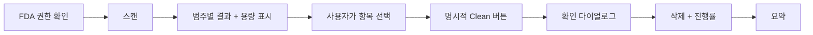
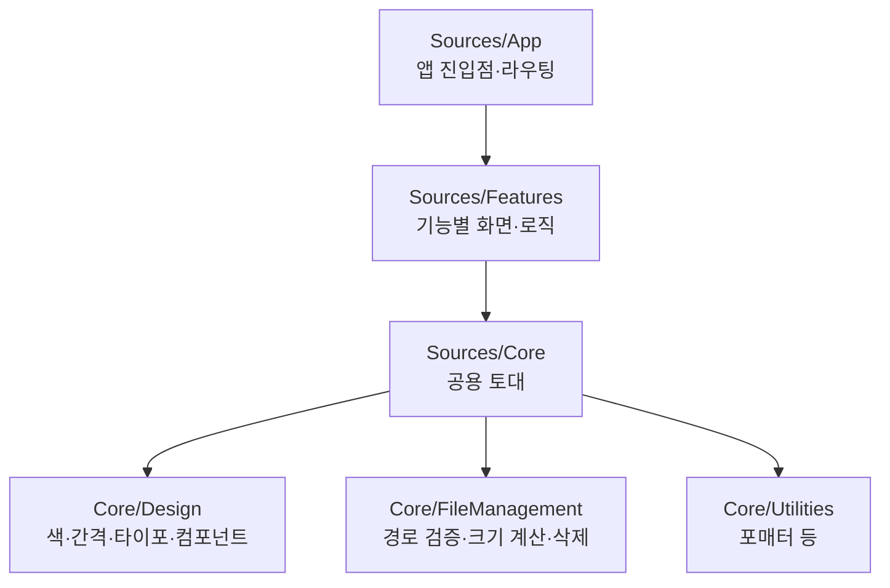

# Kirby 개요 — 이게 대체 뭐 하는 앱이야?

> 이 문서는 Kirby 코드베이스에 처음 들어온 주니어 개발자를 위한 출발점입니다.
> "왜 이렇게 만들었지?"를 따라가며 읽으면 됩니다.

## 한 줄 요약

Kirby는 **macOS용 정리(cleanup) 유틸리티**입니다. CleanMyMac처럼 캐시·로그·휴지통·개발자
정크 같은 "지워도 되는" 파일을 찾아서, 사용자가 확인하면 안전하게 삭제해 디스크 공간을 돌려줍니다.

## 가장 중요한 원칙: "절대 마음대로 지우지 않는다"

정리 앱에서 제일 무서운 건 **실수로 중요한 파일을 지우는 것**입니다. 그래서 Kirby의 모든 설계는
이 한 문장에서 출발합니다:

> 스캔해서 *보여주고*, 사용자가 *직접 선택*하고, *명시적으로 확인*해야만 지운다.

자동 삭제는 없습니다. 흐름으로 보면 이렇습니다:

## 무엇을 청소하나? (PureMac 스타일 10개 범주)

시스템 정크 · 사용자 캐시 · AI 앱(Ollama/LM Studio) · 메일 첨부 · 휴지통 · Xcode 정크 ·
Homebrew 캐시 · Node 캐시(npm/yarn/pnpm) · Docker 캐시 · 대용량·오래된 파일.

각 범주가 보는 경로와 기본 선택 규칙은 [04-cleaner-modules.md](04-cleaner-modules.md)에
정리돼 있습니다. (시스템 캐시·대용량 파일은 안전을 위해 기본 해제, Docker는 미설치 시 비활성.)

## 핵심 기술 결정 (왜 이렇게 골랐나)

- **네이티브 macOS + SwiftUI + Swift 6**: 파일 시스템을 깊이 다루므로 네이티브가 자연스럽고,
  최신 동시성(async/await, `Sendable`)으로 안전하게 병렬 스캔을 한다.
- **비샌드박스 + Full Disk Access(FDA)**: 샌드박스 안에서는 `~/Library/Caches` 같은 다른 앱의
  폴더를 못 본다. 그래서 샌드박스를 끄고, 대신 사용자가 시스템 설정에서 켜는 FDA 권한을 쓴다.
- **하드 삭제로 통일**: "5GB 정리했어요"라고 했는데 공간이 안 늘면 클리너로서 실패다. 그래서
  휴지통으로 옮기는 대신 바로 삭제한다. 대신 삭제 전 **확인 다이얼로그 + 삭제 기록(manifest)** 으로
  안전을 보완한다.
- **Tuist**: `Project.swift`라는 코드로 Xcode 프로젝트를 생성한다. `.xcodeproj`를 git에 안 넣어도
  되고, 설정 충돌이 줄어든다.

> 더 깊은 결정 배경은 저장소 루트의 `PLAN.md`에 정리돼 있습니다.

## 코드 지도 (어디에 뭐가 있나)

다음 문서:
- [01-getting-started.md](01-getting-started.md) — 빌드하고 실행하는 법
- [02-design-system.md](02-design-system.md) — 디자인 토큰 사용법
