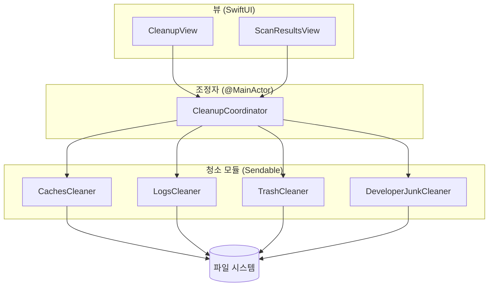
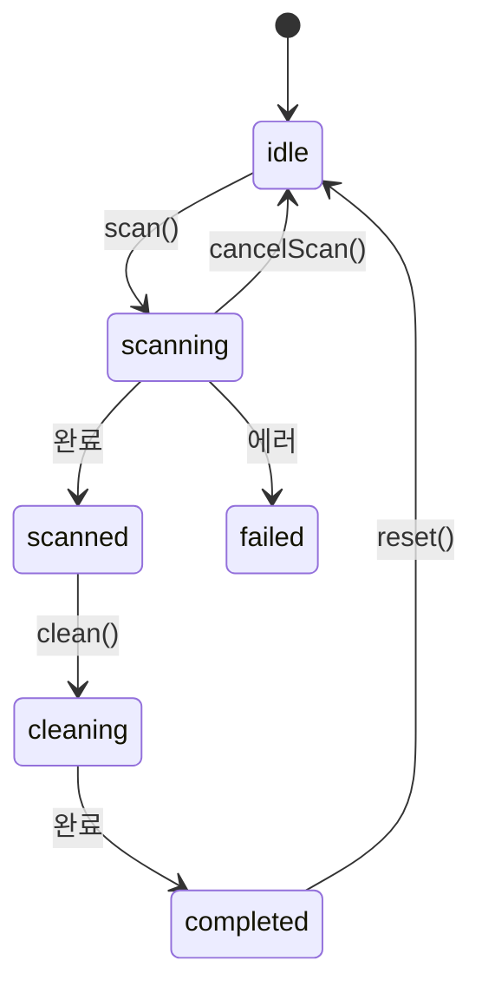

# 아키텍처 — 스캔과 청소는 어떻게 흐르나

> "버튼을 누르면 코드가 어디서 어디로 흘러가지?"를 따라가는 문서입니다.

## 큰 그림: 3개의 층



- **뷰**는 그리기만 한다. 로직을 갖지 않는다.
- **Coordinator**는 상태(state)와 항목(items)을 들고, 모듈을 호출한다. 메인 액터에서만 동작한다.
- **모듈**은 실제 파일 작업(스캔/삭제)을 한다. 서로 독립적이라 병렬로 돌 수 있다.

## 핵심 추상화: `CleanerModule`

청소 가능한 "한 범주"를 표현하는 프로토콜입니다. 딱 두 가지만 할 줄 알면 됩니다:

```swift
protocol CleanerModule: Sendable {
    var category: ScanCategory { get }
    func scan(at root: String) async throws -> [ScanItem]   // 후보 찾기
    func clean(_ items: [ScanItem]) async throws -> CleanSummary  // 삭제
}
```

> 💡 `scan(at root:)`이 홈 경로(`root`)를 **인자로 받는** 점이 중요합니다. 실제 앱에서는
> `NSHomeDirectory()`를 넣지만, 테스트에서는 임시 폴더를 넣어 실제 홈을 건드리지 않고 검증합니다.

## 상태 머신: `ScanState`

Coordinator는 항상 이 중 하나의 상태에 있습니다:



뷰(`CleanupView`)는 이 상태를 보고 어떤 하위 화면을 그릴지 정합니다.

## 병렬 스캔

여러 모듈을 동시에 스캔하려고 `TaskGroup`을 씁니다:

```swift
await withTaskGroup(of: [ScanItem].self) { group in
    for module in modules {
        group.addTask { (try? await module.scan(at: root)) ?? [] }
    }
    for await result in group {
        collected.append(contentsOf: result)   // 메인 액터에서 안전하게 합산
    }
}
```

모듈은 `Sendable`이라 액터 경계를 안전하게 넘나듭니다. 결과를 모으는 일은 메인 액터에서
일어나므로 경쟁 상태(data race)가 없습니다.

## 왜 이렇게 나눴나 (확장성)

새 범주를 추가하고 싶다면? **`CleanerModule` 구현 1개**를 만들고 `DefaultCleanerModules.all()`에
넣으면 끝입니다. 뷰는 `ScanCategory.allCases`를 순회하므로 자동으로 새 범주가 화면에 나타납니다.

더 큰 새 기능(예: 언인스톨러)은 `Feature` enum에 case를 추가하면 사이드바와 라우팅이 확장됩니다.

다음: [04-cleaner-modules.md](04-cleaner-modules.md)
