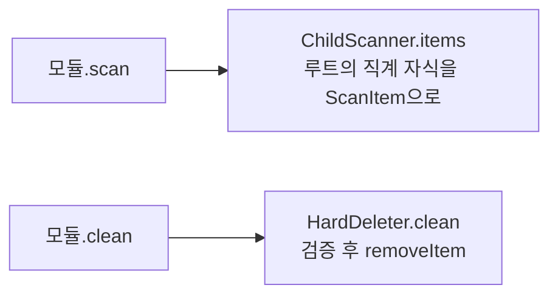

# 청소 모듈 — 무엇을, 어떻게 찾나

> PureMac 스타일 10개 범주가 각각 어디를 보고 무엇을 기본 선택하는지 정리합니다.

## 공통 흐름

대부분의 모듈은 두 개의 공용 헬퍼를 씁니다:



- **`ChildScanner`**: 어떤 루트의 *직계 자식*만 1개 항목으로 집계합니다. 파일 하나하나가 아니라
  폴더 단위라서, 수십만 개 파일을 화면에 나열하지 않습니다. 크기는 `SizeCalculator`가 후손까지
  합산합니다.
- **`HardDeleter`**: 선택 항목을 `PathValidator` 검증 후 영구 삭제하고, 삭제 목록을
  `DeleteManifest`에 기록합니다.

> 예외: `DockerCleaner`는 파일 삭제가 아니라 `docker` CLI를 실행하고, `LargeOldCleaner`는
> 폴더를 재귀 순회해 개별 파일을 찾습니다. 둘은 ChildScanner를 쓰지 않습니다.

## 범주별 정리 (10종)

| 모듈 | 대상 | 기본 선택 | 특이사항 |
|---|---|---|---|
| `SystemJunkCleaner` | `~/Library/Logs`(7일+) · `/Library/Caches` | 로그만 ✓ | 시스템 캐시는 위험 → 기본 해제(`isSafe=false`) |
| `UserCacheCleaner` | `~/Library/Caches` | 전부 ✓ | `CacheDenylist` 항목 제외 |
| `AIAppsCleaner` | Ollama·LM Studio 로그/캐시 | ✓ | 모델·대화 데이터는 건드리지 않음 |
| `MailCleaner` | Mail 첨부 다운로드 폴더 | ✓ | |
| `TrashCleaner` | `~/.Trash` | ✓ | 휴지통 비우기 |
| `XcodeCleaner` | DerivedData·CoreSimulator Caches·Archives·CocoaPods | DerivedData/Caches ✓ | Devices 절대 제외 |
| `BrewCleaner` | `~/Library/Caches/Homebrew` | ✓ | `HOMEBREW_CACHE` 환경변수 존중 |
| `NodeCleaner` | `~/.npm`·`~/.yarn/cache`·pnpm store | ✓ | |
| `DockerCleaner` | `docker system df`/`prune` | 해제 | docker 미설치 시 빈 결과 |
| `LargeOldCleaner` | 사용자 폴더의 >100MB 또는 1년+ 파일 | 해제 | 사용자 데이터 → 절대 자동선택 안 함 |

### Xcode 정크의 루트들

```
Library/Developer/Xcode/DerivedData         ✓ 기본 선택
Library/Developer/CoreSimulator/Caches      ✓   (Devices는 절대 건드리지 않음!)
Library/Developer/Xcode/Archives            ✗ 기본 해제(앱 재서명에 필요할 수 있음)
.cocoapods                                  ✗ 기본 해제(다시 받기 느림)
```

> ⚠️ **CoreSimulator는 `Caches`만** 대상입니다. `Devices`(시뮬레이터 본체)는 정크가 아니므로
> 절대 목록에 넣지 않고, `PathValidator`의 거부 목록에도 들어 있습니다.

### 특수 모듈 2종

- **`DockerCleaner`**: `Shell.find("docker")`로 docker를 찾고 `docker system df`로 회수 가능
  용량을 추정해 한 항목으로 보여줍니다. 정리는 `docker system prune -af` 실행. docker가 없으면
  스캔 결과가 비어 표시되지 않습니다.
- **`LargeOldCleaner`**: `Downloads/Documents/Desktop/Movies/Music`를 순회해 100MB 이상 또는
  1년 넘은 파일을 최대 200개까지 큰 것부터 보여줍니다. **사용자 데이터이므로 기본 해제**이고
  `isSafeToDelete=false`로 표시됩니다.

## 새 (큐레이션) 범주 추가하는 법

새 범주는 **알려진 안전 경로**여야 합니다(임의 폴더 청소는 LargeOld 외 범위 밖).

```swift
struct BrowserCacheCleaner: CleanerModule {
    let id = "browserCache"
    let category = ScanCategory.userCache   // 또는 새 case
    let displayName = "브라우저 캐시"

    func scan(at root: String) async throws -> [ScanItem] {
        ChildScanner.items(
            root: root + "/Library/Caches/com.apple.Safari",
            category: category, defaultSelected: true, isSafe: true)
    }
    func clean(_ items: [ScanItem]) async throws -> CleanSummary {
        HardDeleter.clean(items)
    }
}
```

새 `case`를 `ScanCategory`에 더하고(제목·아이콘), 모듈을 `DefaultCleanerModules.all()`에 추가하면
끝입니다. 사이드바·결과 화면·Dashboard 도넛은 `ScanCategory.allCases`를 순회하므로 자동 반영됩니다
(Dashboard 색상 맵에만 새 case 색을 추가).

다음: [05-safety.md](05-safety.md)
