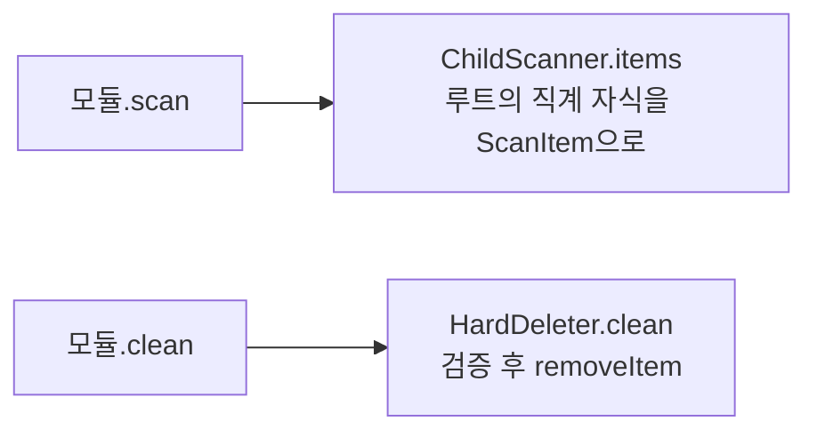

# 청소 모듈 — 무엇을, 어떻게 찾나

> 4개 범주가 각각 어디를 보고 무엇을 기본 선택하는지 정리합니다.

## 공통 흐름

모든 모듈은 두 개의 공용 헬퍼를 씁니다:



- **`ChildScanner`**: 어떤 루트의 *직계 자식*만 1개 항목으로 집계합니다. 파일 하나하나가 아니라
  폴더 단위라서, 수십만 개 파일을 화면에 나열하지 않습니다. 크기는 `SizeCalculator`가 후손까지
  합산합니다.
- **`HardDeleter`**: 선택 항목을 `PathValidator` 검증 후 영구 삭제하고, 삭제 목록을
  `DeleteManifest`에 기록합니다.

## 범주별 정리

| 모듈 | 루트 경로 | 기본 선택 | 특이사항 |
|---|---|---|---|
| `CachesCleaner` | `~/Library/Caches` | 전부 ✓ | `CacheDenylist` 항목 제외 |
| `LogsCleaner` | `~/Library/Logs` | 7일 초과만 ✓ | 수정일 기준 |
| `TrashCleaner` | `~/.Trash` | 전부 ✓ | 휴지통 비우기 |
| `DeveloperJunkCleaner` | 여러 곳(아래) | 일부만 ✓ | Xcode/패키지 매니저 |

### 개발자 정크의 루트들

```
Library/Developer/Xcode/DerivedData         ✓ 기본 선택
Library/Developer/CoreSimulator/Caches      ✓   (Devices는 절대 건드리지 않음!)
.npm                                        ✓
.yarn/cache                                 ✓
Library/Caches/Homebrew                     ✓
.cocoapods                                  ✗ 기본 해제(다시 받기 느림)
Library/Developer/Xcode/Archives            ✗ 기본 해제(앱 재서명에 필요할 수 있음)
```

> ⚠️ **CoreSimulator는 `Caches`만** 대상입니다. `Devices`(시뮬레이터 본체)는 정크가 아니므로
> 절대 목록에 넣지 않고, `PathValidator`의 거부 목록에도 들어 있습니다.

## 새 (큐레이션) 범주 추가하는 법

결정 3에 따라 새 범주는 **반드시 알려진 안전 경로**여야 합니다(임의 폴더 청소는 범위 밖).

```swift
struct BrowserCacheCleaner: CleanerModule {
    let id = "browserCache"
    let category = ScanCategory.cache   // 또는 새 case
    let displayName = "브라우저 캐시"

    func scan(at root: String) async throws -> [ScanItem] {
        ChildScanner.items(
            root: root + "/Library/Caches/com.apple.Safari",
            category: category, defaultSelected: true, isSafe: true)
    }
    func clean(_ items: [ScanItem]) async throws -> CleanSummary {
        HardDeleter.clean(items)
    }
}
```

그리고 `DefaultCleanerModules.all()`에 추가하면 끝. 뷰는 손대지 않습니다.

다음: [05-safety.md](05-safety.md)
