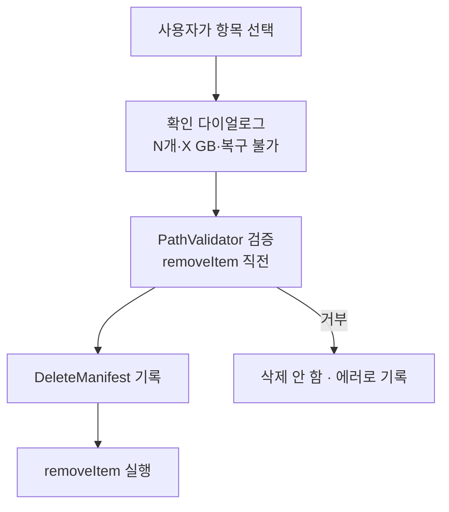
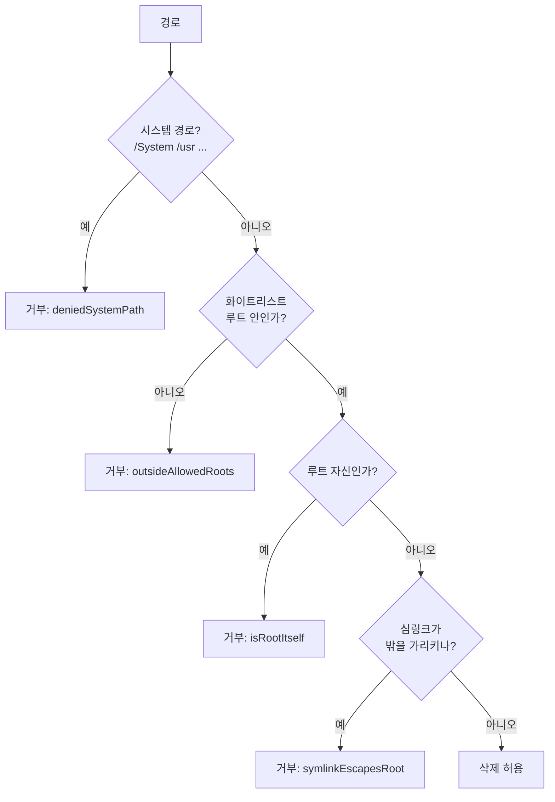

# 안전 — "절대 잘못 지우지 않기" 위한 장치들

> 하드 삭제(영구 삭제)를 하기로 했기 때문에(결정 1), 안전장치가 더더욱 중요합니다.

## 4겹의 방어선



### 1. 사용자 검토·선택
스캔 결과를 보여주고, 사용자가 직접 끄고 켭니다. 위험한 것들은 애초에 기본 해제거나 제외됩니다.

### 2. 명시적 확인 다이얼로그
"Clean"을 눌러도 바로 안 지웁니다. "N개 항목, 총 X GB를 삭제합니다. 복구할 수 없습니다."라는
확인을 한 번 더 받습니다(`CleanupView`의 `confirmationDialog`).

### 3. `PathValidator` (가장 중요)
모든 `removeItem` **직전에** 호출됩니다. 다음 중 하나라도 걸리면 삭제를 거부합니다:



> 화이트리스트 루트는 각 항목의 부모 폴더에서 도출됩니다(항목은 우리 스캐너가 만든 직계
> 자식이므로 부모 = 스캔 루트). 거기에 시스템 경로 차단이 바닥 안전망으로 깔립니다.

### 4. `DeleteManifest`
삭제 직전, 어떤 경로를 지우는지 `~/Library/Logs/Kirby/clean-<시각>.log`에 적습니다. 하드
삭제라 복구는 안 되지만, "무엇을 지웠는지"는 추적할 수 있습니다.

## 캐시 denylist

`~/Library/Caches`에는 캐시처럼 보여도 지우면 안 되는 폴더가 섞여 있습니다(iCloud 동기화 상태
등). `CacheDenylist`가 이들을 스캔 결과에서 **아예 제외**합니다.

```swift
static let folderNames: Set<String> = [
    "CloudKit", "com.apple.bird", "com.apple.cloudd", ...
]
```

## 부분 실패는 정상

파일이 사용 중이거나 권한이 없으면 삭제가 실패할 수 있습니다. 이때 전체가 멈추지 않고, 해당
항목만 건너뛰며 `CleanSummary.errors`에 모읍니다. 요약 화면이 "M개 건너뜀"으로 알려줍니다.

다음: [06-fda-permissions.md](06-fda-permissions.md)
