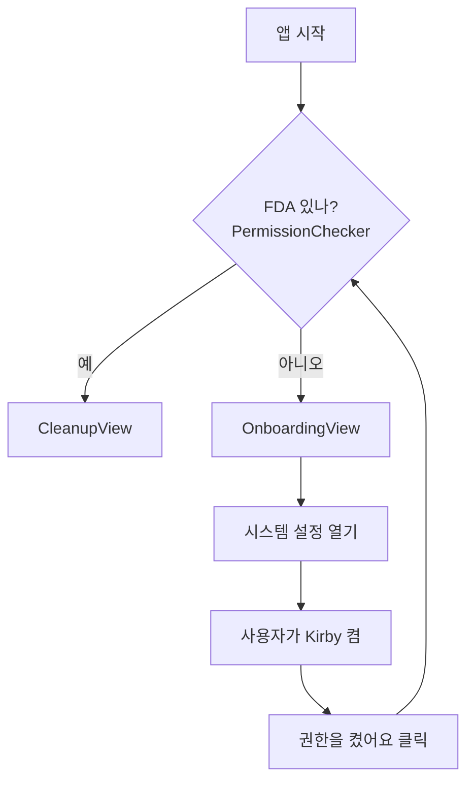

# 권한 — 전체 디스크 접근(FDA)

> Kirby가 다른 앱의 캐시·로그를 읽으려면 macOS의 특별한 권한이 필요합니다.

## 왜 필요한가

샌드박스 앱은 자기 폴더 밖을 못 봅니다. Kirby는 `~/Library/Caches` 등 시스템 곳곳을 봐야 하므로
**샌드박스를 끄고**, 대신 **전체 디스크 접근(Full Disk Access, FDA)** 권한을 씁니다. FDA는
엔타이틀먼트가 아니라 **사용자가 시스템 설정에서 직접 켜는** 권한입니다.

## 흐름



## 어떻게 확인하나 (공식 API가 없다)

macOS는 "FDA 있어?"라고 묻는 API를 주지 않습니다. 그래서 **FDA가 있어야만 읽히는 보호 경로**를
실제로 읽어보는 프로브 방식을 씁니다:

```swift
let probe = NSHomeDirectory() + "/Library/Safari"
// 이걸 읽을 수 있으면 FDA 있음, 못 읽으면 없음
```

## 설정 화면 바로 열기

```swift
NSWorkspace.shared.open(URL(string:
    "x-apple.systempreferences:com.apple.preference.security?Privacy_AllFiles")!)
```

## 개발할 때 주의점 ⚠️

FDA는 **코드 서명 신원 + 실행 파일 경로** 기준으로 부여됩니다. 개발 중 앱을 리빌드하면 권한이
풀려서 "분명 켰는데 또 안 됨" 상황이 생길 수 있습니다. 이때는 시스템 설정에서 Kirby를 한 번
껐다 켜거나, 다시 추가하면 됩니다. 안정적인 ad-hoc 서명을 쓰면 빈도가 줄어듭니다.

> 테스트는 FDA가 필요 없는 임시 폴더로 하기 때문에, 이 권한 문제는 **수동 E2E**에서만 다룹니다.
