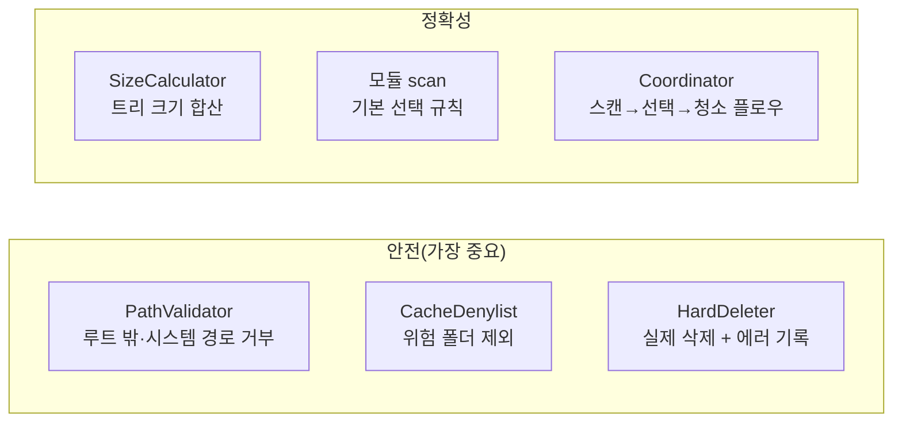

# 테스트와 검증 — 안전한 앱을 어떻게 보장하나

> "내가 고친 게 뭘 깨뜨리진 않았나?"를 빠르게 확인하는 방법입니다.

## 테스트 프레임워크

Swift Testing을 씁니다(XCTest 아님). 핵심 문법은 셋뿐:

```swift
import Testing
@Suite("그룹 이름")
struct MyTests {
    @Test("이 동작을 검증한다")
    func something() {
        #expect(1 + 1 == 2)
    }
}
```

## 자동 테스트로 무엇을 검증하나



전부 **임시 디렉터리**에 픽스처를 만들어 검증하므로, 진짜 홈 폴더를 절대 건드리지 않습니다.

```bash
xcodebuild -workspace Kirby.xcworkspace -scheme Kirby \
  -destination 'platform=macOS,arch=arm64' test
```

## 수동 E2E (사람이 직접 확인)

자동으로 못 하는 것들입니다:

1. **FDA 권한**: `tccutil reset SystemPolicyAllFiles`로 권한을 초기화 → 앱 실행 → 온보딩이
   나오는지 → 권한을 켜면 본 화면으로 넘어가는지.
2. **스캔 정확성**: `/tmp/kirby-test/Library/Caches`에 더미 파일을 만들고 루트를 주입해 용량이
   맞는지.
3. **삭제**: 안전한 픽스처를 정리 → 실제로 사라지는지 + `~/Library/Logs/Kirby`에 manifest가
   남는지.
4. **디자인**: pill 버튼 모양, 카드 보더, 라이트 외형, 토큰 값 일치.

## 커버리지 목표

핵심 안전/정확성 로직 80% 이상. 뷰는 시각 확인으로 보완합니다(마크업 단언보다 신호가 큼).
